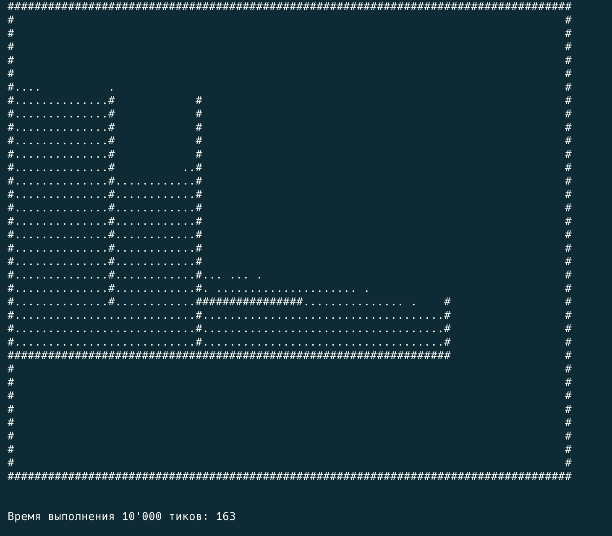
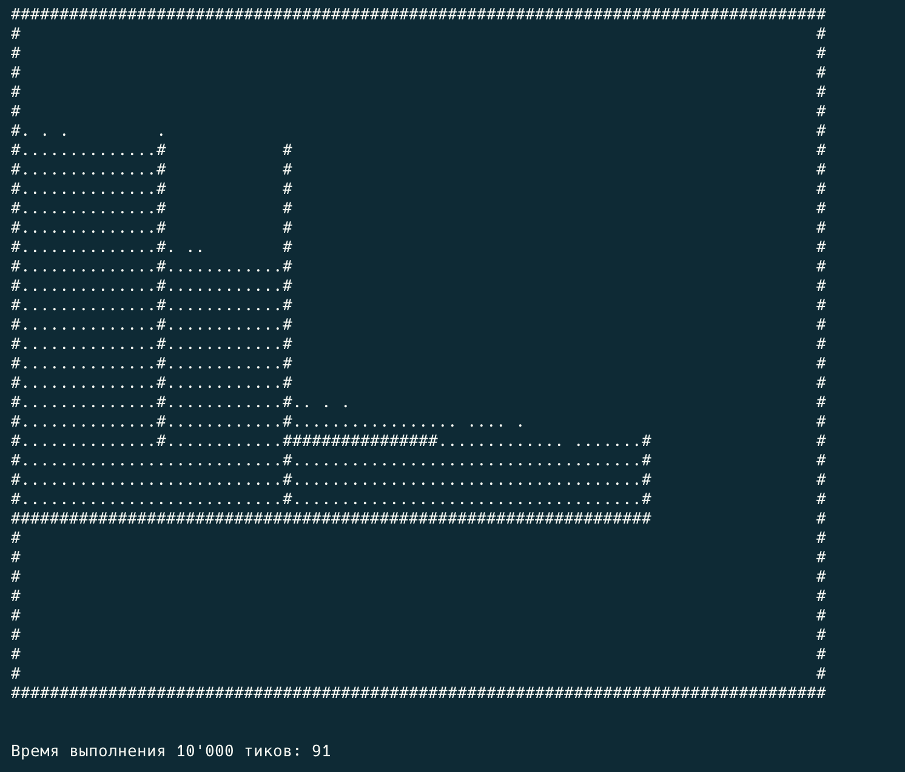
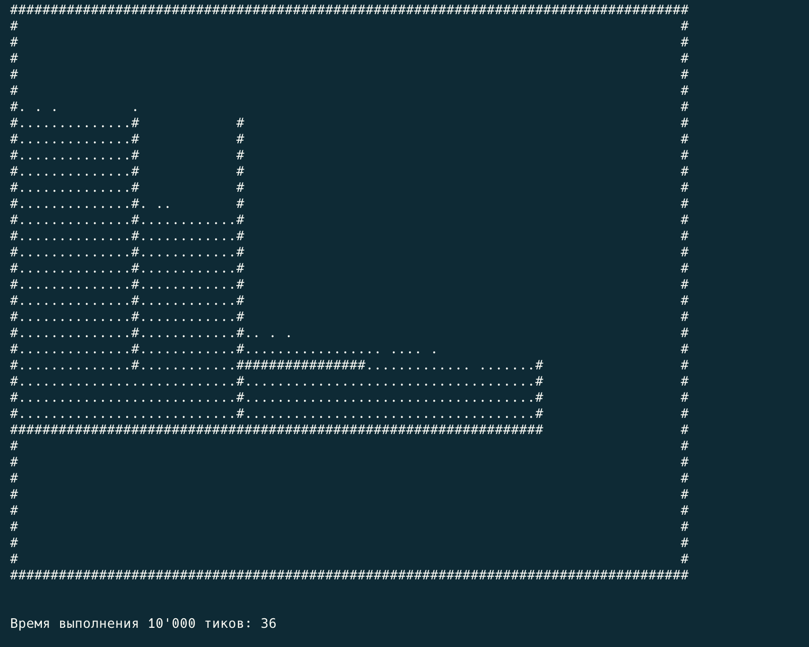
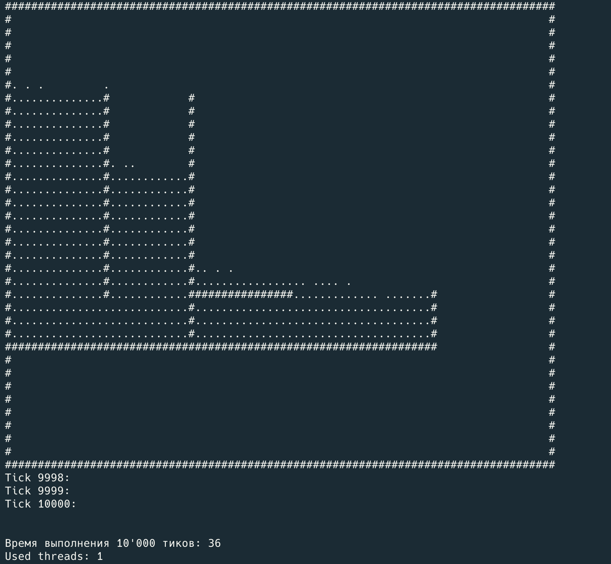
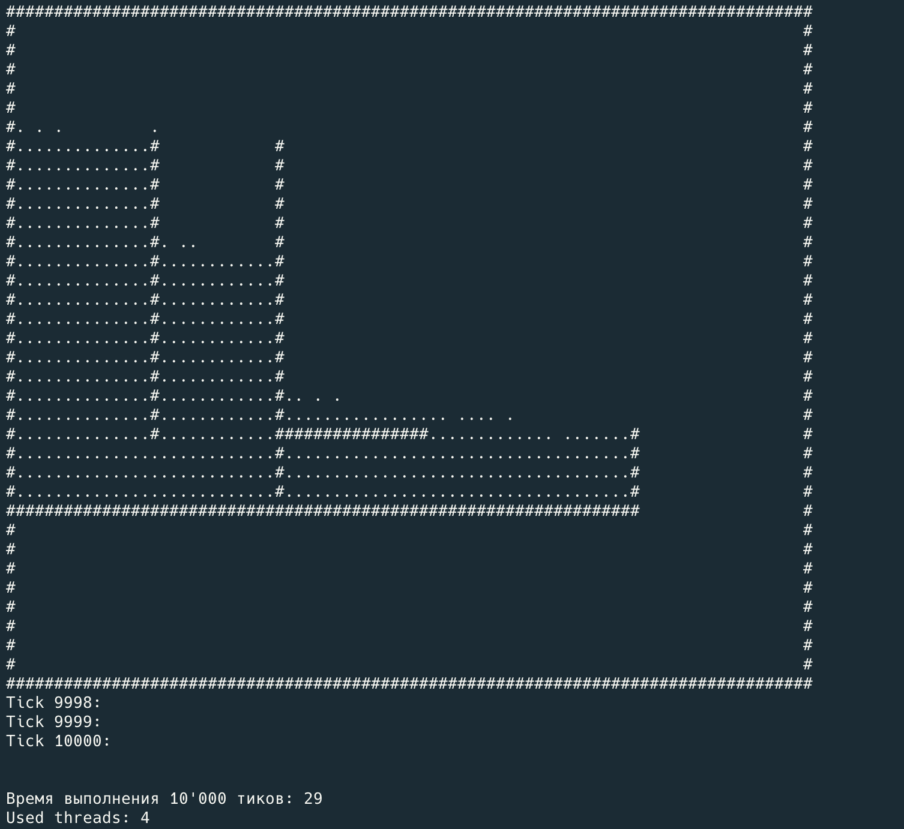
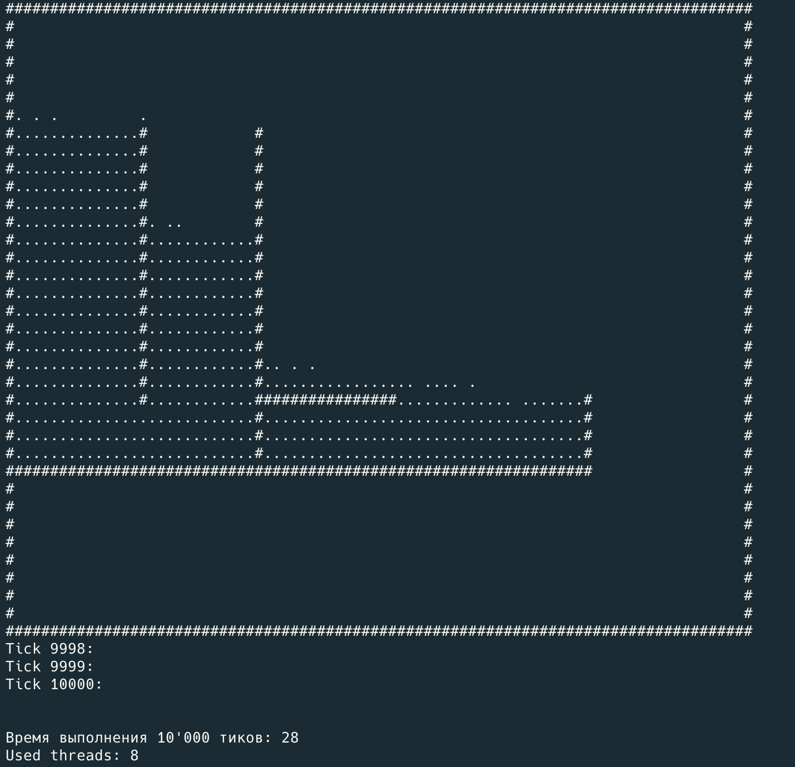

# Отчет об ускорении симулятора поведения несжимаемых жидкостей в замкнутом пространстве

Задание выполнено в рамках дз3 по курсу "Программирование на C++"

---

## Оглавление
### Отчет
- [Проблемы исходного кода](#проблемы-исходного-кода)
- [Произведенные ускорения (без параллелизма)](#произведенные-ускорения-без-параллелизма)
- [Параллелизм](#параллелизм)
- [Результаты замеров](#результаты-замеров)
- [Таблица замеров времени](#таблица-замеров-времени)
- [Структура проекта](#структура-проекта)
### Остальное
- [Опции запуска](#опции-запуска)
- [Сборка и запуск](#сборка-и-запуск)

---

## Проблемы исходного кода

### Недостатки предыдущей версии:
- [ ] Низкая производительность при больших объемах данных из-за плохо написанных функций
- [ ] Все функции выполняются последовательно, что замедляет работу программы
---
## Произведенные ускорения (без параллелизма)

### 1. Оптимизация некоторых функций:
- В методе ```propagate_flow``` изменен медленный 
   ```cpp
   auto [t, prop, end] = propagate_flow(nx, ny, vp);
    ```
  на более быстро работающий
   ```cpp
    velocity_flow_t t;
    bool prop;
    std::pair<int, int> end;
    do {
        std::tie(t, prop, end) = propagate_flow(nx, ny, vp);
    } while (end == std::pair(nx, ny));
  ```
- Оптимизировано заполнение векторного поля 
  ```cpp
  VectorField<velocity_flow_t, value_N, value_M> velocity_flow = {};
  ```

  путем пропуска "пустых" проходов цикла
   ```cpp
   if (t > int64_t(0)) {
       prop = true;
       --y;
   }
   ```
- Оптимизировано метод ```get``` у класса ```VectorField```
  ```cpp
  Fixed &get(int x, int y, int dx, int dy) {
      size_t i = ranges::find(deltas, pair(dx, dy)) - deltas.begin();
      assert(i < deltas.size());
      return v[x][y][i];
  }
  ```
  заменой на 
  ```cpp
  T &get(int x, int y, int dx, int dy) {
      switch ((dx << 1) + dy) {
          case 1:
              return v[x][y][3];
          case 2:
              return v[x][y][1];
          case -1:
              return v[x][y][2];
          default:
              return v[x][y][0];
      }
  }
  ```
### 2. Удаление кода, который не используется

## Параллелизм

### Сделан (адаптирован) thread-pool [buddies.h](buddies.h) 
Исходник взят из [репозитория одногруппника](https://github.com/AtomicBiscuit/SE2_CPP_HW3/blob/main/include/workers.h) (т.к. я не успевал и не особо понимал как сделать свой) и адаптирован под мой код

### Добавлена обработка параметра ```--threads``` - количества потоков
Теперь при запуске собранного проекта можно указать количество потоков (минимум 1)

### Основные функции симулятора жидкости стали доступны для выполнения параллельно

Для этого был модифицирован класс ```Fluid``` и добавлен класс ```Mission```

## Результаты замеров

Графики и метрики производительности:

### Время выполнения
До оптимизации:


После выполнения оптимизации ```propagate_flow```:


После выполнения остальных оптимизации без параллелизма:


После добавления параллелизма (проверка работы с 1 потоком):


После добавления параллелизма (проверка работы с 4 потоками):


После добавления параллелизма (проверка работы с 8 потоками):


## Таблица замеров времени
Все замеры проводились на одном и том же наборе данных

Количество тиков: ```10000```

Размер поля: ```36x84``` ([input.txt](input.txt))

Параметры запуска:
```bash
--input-file=../input.txt --save-file=../saved-position.txt --p-type="FIXED(32,7)" --v-type="FIXED(32,7)" --v-flow-type="FIXED(32,7)" --threads="2"
```

|                  Тест                  |  Время  | Дельта от предыдущего |
|:--------------------------------------:|:-------:|:---------------------:|
| Время выполнения до внесения изменений | 164 сек |         start         |
|           Первая оптимизация           | 91 сек  |          73           |
|           Вторая оптимизация           | 36 сек  |          55           |
|                1 поток                 | 36 сек  |           0           |
|                4 потока                | 29 сек  |           7           |
|               8 потоков                | 28 сек  |           1           |

Разница между первым и последним запуском составляет ```136 секунд```, или же скорость работы программы увеличилась в ```5.857```
раз

Если считать ускорение без использования потоков, то программа ускорилась в ```4.556``` раза

## Структура проекта

- [main.cpp](main.cpp) — основной файл
- [fluid.h](fluid.h) — симулятор жидкости
- [fluid-creator.h](fluid-creator.h) — "шаблонное нечто", создающее симулятор
- [fixed.h](fixed.h) — шаблонный ```Fixed```
- [saved-data-cleaner.cpp](saved-data-cleaner.cpp) — очиститель файлов с параметрами симуляции
- [vector-field.h](vector-field.h) - класс для работы с векторными полями
- [buddies.h](buddies.h) - класс для работы с потоками
- [mission.h](mission.h) - класс для работы с задачами

---

## Опции запуска

Доступные опции для запуска:

- В параметрах командной строки к собранному проекту можно указать:
  - ```--input-file``` - путь к файлу с входными данными
  - ```--save-file``` - путь к файлу, в который будут сохраняться параметры симуляции
  - ```--p-type``` - тип для давления
  - ```--v-type``` - тип для скорости
  - ```--v-flow-type``` - тип для скорости потока
  - ```--threads``` - количество потоков
- Параметры компиляции указываются в [CMakeLists.txt](CMakeLists.txt) в виде ```target_compile_definitions```

---
## Сборка и запуск

### Предварительные требования

- Работающий Cmake
- Компилятор языка C++
- UNIX-система (или подобная) (На Windows происходит ошибка рекурсии, решения найти я не успел) (У себя проект собирал и запускал на MacOS)

### Сборка проекта

1. Создайте папку для сборки (опционально):
   ```bash
   mkdir build
   ```

2. Перейдите в папку сборки (опционально):
   ```bash
   cd build
   ```
3. Соберите проект с помощью cmake:
   ```bash
   cmake ..
   ```
    ```bash
   cmake --build .
   ```
---
### Запуск проекта
Примеры запуска:
   ```bash
   ./fluid-simulator --input-file=../input.txt --save-file=../saved-position.txt --p-type="FIXED(32,7)" --v-type="FIXED(32,7)" --v-flow-type="FIXED(32,7)" --threads="2"
   ```
   ```bash
   ./fluid-simulator --input-file=../input.txt --save-file=../saved-position.txt --p-type="FIXED(32,7)" --v-type="FAST_FIXED(52,13)" --v-flow-type="DOUBLE" --threads="4"
   ```

Для остановки программы используйте Ctrl+C (Control+C), информация будет сохранена в файл (```saved-position.txt```), для выхода из программы используйте Q, для продолжения используйте C
